# NOMENCLATURE
# Deep Component Variation Axis Nomenclature

## Structure for Axis Names

- 3 item types
```
- A: Position of Alteration
- B: Name of Stroke or Element 
- C: Type of Alteration
```
Formatting with underscore separators:
A_B_C

- Exemples:
    
    - L_S_sh (左边_竖_缩短)
        
        - Left_Shu_shorter (Shu = vertical)

    - TL_HP_mo (顶部右_横撇_位移)
    
        - Top Left_Heng Pie_move (Heng Pie = Horizontal Throw)

    - X_X_fl (无_无_变扁)

    	- No Alteration_No Alteration_flat

    - T_X_na (顶部_无_变窄)

    	- Top_No Alteration_narrow

## Position of Alteration

Indicates where alteration occurs in the Deep Component.

### Nomenclature:

#### ① Primary Position (use this in priority)

code    |Meaning      |Hanzi
:------:|:-----------:|:---:
L       |Left         |左边 
M       |Middle       |中部 
R       |Right        |右边 
T       |Top          |顶部 
B       |Bottom       |底部 

#### ② Detailed Position (if higher precisionn is required)

Code    |Meaning      |Hanzi 
:------:|:-----------:|:----:
TL      |Top Left     |顶部左
TM      |Top Middle   |顶部中
TR      |Top Right    |顶部右
ML      |Middle Left  |中部右
C       |Center       |中心部
MR      |Middle Right |中部右
BL      |Bottom Left  |底部左
BM      |Bottom Middle|底部中
BR      |Bottom Right |底部右

*Minimize the use of ② if possible to keep the name short. 

*Only use ② when the ① is insufficient for the description, like when two identical strokes are on the same side and need to make the same change.

### Map

#### ① Primary Position

<br/><br/><br/><br/>&nbsp;&nbsp;&nbsp;&nbsp;&nbsp;&nbsp;**L**&nbsp;&nbsp;&nbsp;&nbsp;&nbsp;&nbsp;<br/><br/><br/><br/><br/>|<br/><br/><br/><br/>&nbsp;&nbsp;&nbsp;&nbsp;&nbsp;&nbsp;**M**&nbsp;&nbsp;&nbsp;&nbsp;&nbsp;&nbsp;<br/><br/><br/><br/><br/>|<br/><br/><br/><br/>&nbsp;&nbsp;&nbsp;&nbsp;&nbsp;&nbsp;**R**&nbsp;&nbsp;&nbsp;&nbsp;&nbsp;&nbsp;<br/><br/><br/><br/><br/>
:-:|:-:|:-:

<br/>&nbsp;&nbsp;&nbsp;&nbsp;&nbsp;&nbsp;&nbsp;&nbsp;&nbsp;&nbsp;&nbsp;&nbsp;&nbsp;&nbsp;&nbsp;&nbsp;&nbsp;&nbsp;&nbsp;&nbsp;&nbsp;&nbsp;&nbsp;&nbsp;&nbsp;&nbsp;&nbsp;&nbsp;T&nbsp;&nbsp;&nbsp;&nbsp;&nbsp;&nbsp;&nbsp;&nbsp;&nbsp;&nbsp;&nbsp;&nbsp;&nbsp;&nbsp;&nbsp;&nbsp;&nbsp;&nbsp;&nbsp;&nbsp;&nbsp;&nbsp;&nbsp;&nbsp;&nbsp;&nbsp;<br/>&nbsp;|
:-:|
<br/>&nbsp;&nbsp;&nbsp;&nbsp;&nbsp;&nbsp;&nbsp;&nbsp;&nbsp;&nbsp;&nbsp;&nbsp;&nbsp;&nbsp;&nbsp;&nbsp;&nbsp;&nbsp;&nbsp;&nbsp;&nbsp;&nbsp;&nbsp;&nbsp;&nbsp;&nbsp;&nbsp;&nbsp;M&nbsp;&nbsp;&nbsp;&nbsp;&nbsp;&nbsp;&nbsp;&nbsp;&nbsp;&nbsp;&nbsp;&nbsp;&nbsp;&nbsp;&nbsp;&nbsp;&nbsp;&nbsp;&nbsp;&nbsp;&nbsp;&nbsp;&nbsp;&nbsp;&nbsp;&nbsp;<br/>&nbsp;|
<br/>&nbsp;&nbsp;&nbsp;&nbsp;&nbsp;&nbsp;&nbsp;&nbsp;&nbsp;&nbsp;&nbsp;&nbsp;&nbsp;&nbsp;&nbsp;&nbsp;&nbsp;&nbsp;&nbsp;&nbsp;&nbsp;&nbsp;&nbsp;&nbsp;&nbsp;&nbsp;&nbsp;&nbsp;B&nbsp;&nbsp;&nbsp;&nbsp;&nbsp;&nbsp;&nbsp;&nbsp;&nbsp;&nbsp;&nbsp;&nbsp;&nbsp;&nbsp;&nbsp;&nbsp;&nbsp;&nbsp;&nbsp;&nbsp;&nbsp;&nbsp;&nbsp;&nbsp;&nbsp;&nbsp;<br/>&nbsp;|

#### ② Detailed Position 

<br/>&nbsp;&nbsp;&nbsp;&nbsp;TL&nbsp;&nbsp;&nbsp;&nbsp;<br/>&nbsp;|<br/>&nbsp;&nbsp;&nbsp;&nbsp;TM&nbsp;&nbsp;&nbsp;&nbsp;<br/>&nbsp;|<br/>&nbsp;&nbsp;&nbsp;&nbsp;TR&nbsp;&nbsp;&nbsp;&nbsp;<br/>&nbsp;|
:-:|:-:|:-:|
<br/>&nbsp;&nbsp;&nbsp;&nbsp;**ML**&nbsp;&nbsp;&nbsp;&nbsp;<br/>&nbsp;|<br/>&nbsp;&nbsp;&nbsp;&nbsp;**C**&nbsp;&nbsp;&nbsp;&nbsp;<br/>&nbsp;|<br/>&nbsp;&nbsp;&nbsp;&nbsp;**MR**&nbsp;&nbsp;&nbsp;&nbsp;<br/>&nbsp;|
<br/>&nbsp;&nbsp;&nbsp;&nbsp;**BL**&nbsp;&nbsp;&nbsp;&nbsp;<br/>&nbsp;|<br/>&nbsp;&nbsp;&nbsp;&nbsp;**BM**&nbsp;&nbsp;&nbsp;&nbsp;<br/>&nbsp;|<br/>&nbsp;&nbsp;&nbsp;&nbsp;**BR**&nbsp;&nbsp;&nbsp;&nbsp;<br/>&nbsp;|

## Name of Stroke or Element

- Stroke names is based on Pinyin spelling.

- For the sake of brevity, the compound strokes in the axis name will use the name of the part that changed.</br>
Exemple the stroke Vertical Rise 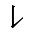 often only change its "Rise" part so, we simply use "T"  in the axis name but not "ST" (Vertical Rise).

- Stroke Naming Reference: [CJK stroke](http://www.unicode.org/charts/PDF/U31C0.pdf)

### Basic Strokes

Code |Meaning      |PinYin|Hanzi|Glyph
:---:|:-----------:|:----:|:---:|:---:
H    |Horizontal   |Heng  |横   |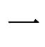   
S    |Vertical     |Shu   |竖   |   
P    |Throw Away   |Pie   |撇   |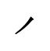     
N    |Press Down   |Na    |捺   |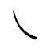   
D    |Dot          |Dian  |点   |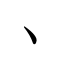   
T    |Rise         |Ti    |提   |   

### Compound Strokes

Code    |Meaning                |PinYin     |Hanzi |Glyph |
:------:|:---------------------:|:---------:|:----:|:----:
HG      |Horizontal Hook        |Heng Gou   |横勾   |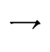    
HP      |Horizontal Throw       |Heng Pie   |横撇   |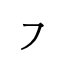    
SG      |Vertical Hook          |Shu Gou    |竖勾   |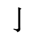    
SWG     |Vertical Turning Hook  |Shu Wan Gou|竖弯钩 |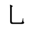    
XG      |Slant Hook             |Xie Gou    |斜勾   |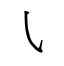    
SW      |Vertical Turning       |Shu Wan    |竖弯   |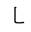    

### Special Elements

Code   |Meaning        |PinYin   |Hanzi
:-----:|:-------------:|:-------:|:--:
ZH     |Combination    |Zu He    |组合
ZX     |Barycenter     |Zhong Xin|重心
ZQ     |Counter        |Zi Qiang |字腔
WV      |Weight  Vertical       |X     |横字重
WH      |Weight  Horizontal     |X     |竖字重

## Type of Alteration

- Type of alteration use lower cases letters.

### Proportion Alterations

Code    |Meaning      |Hanzi
:------:|:-----------:|:---:
na      |narrow       |变窄 
fl      |flat         |变扁 
mi      |minify       |缩小 

### Stroke Alterations

Code    |Meaning       |Hanzi    
:------:|:------------:|:-------:
sh      |shorter       |缩短
lo      |longer        |加长         
mo      |move          |位移     
ro      |rotation      |旋转
sl      |slant         |倾斜      
2s      |2 side shorter|两边缩进 
2l      |2 side longer |两边加长 

### Counter Alterations

Code  |Meaning       |Hanzi  
:----:|:------------:|:------:
re    |reduce counter|收缩
op    |open counter  |放大

### Barycenter Alterations

Code  |Meaning          |Hanzi   
:----:|:---------------:|:------:
hi    |higher barycenter|提高
lo    |lower barycenter |降低

## 

Code  |Meaning          |Hanzi   
:----:|:---------------:|:------:
bo    |bolder           |加粗     
th    |thiner           |减细 
